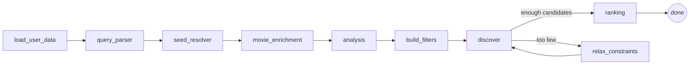

# KinoAgent

A movie-recommendation **LLM agent** that turns a free-form natural-language request
into a ranked list of films, blended with your personal taste from a Letterboxd export.
Built as a **LangGraph** pipeline over the TMDB API.

> *"Japanese cinema from the 2010s about food and everyday life"* →
> Sweet Bean · Midnight Diner · Little Forest · Bread of Happiness · The Last Recipe

---

## Demo

Three runs of different types of prompts — each exercises a different retrieval source, and the
analysis re-prioritises its axes per query. Run against an empty profile (no personal
taste / watched data):

| Query | Retrieval source | Leading axis | Crew the model nominated | Top picks |
|---|---|---|---|---|
| *Japanese cinema from the 2010s about food and everyday life, no violence* | keyword ladder | **theme** | Kore-eda + his DP | Little Forest, Midnight Diner, Sweet Bean, Bread of Happiness, The Last Recipe |
| *something like Lost in Translation — that lonely-in-a-city mood but in New York* | seed pool (1 seed) | **mood** | Sofia Coppola + Lance Acord (her DP) | The Apartment, Jersey Girl, Her — all set in NYC |
| *movies like Blue Velvet and Eyes Wide Shut* | seed **intersection** (2 seeds) | **visual** | Lynch & Kubrick + both DPs (Elmes, Smith) | Mulholland Drive, Twin Peaks: Fire Walk with Me, The Shining, Shutter Island, Vertigo |

What the three illustrate:
- **Axis priority is query-dependent** — food leads with *theme*, the mood request with *mood*, the two-seed pair with *visual*. The model ranks its own axes per query.
- **Emblematic crew** — with no person named, the model routes the request to the right film-makers: the director **and cinematographer** of *Lost in Translation*, and the directors *and* DPs of *both* films in the Blue Velvet + Eyes Wide Shut pair (Lynch & Frederick Elmes, Kubrick & Larry Smith).
- **Setting** — "in New York" is honoured by the ranker (top three are all NYC-set).
- **Each query highlights a different retrieval path** — the keyword ladder, the single-seed recommendation pool, and the two-seed intersection of that pool (the emblematic-crew search runs alongside all three).

## Architecture



One line per node:
- **load_user_data** — pull watched/ratings from the local SQLite DB
- **query_parser** — extract seed titles + hard constraints (country, language, dates)
- **seed_resolver** — resolve seed titles to TMDB IDs (picks the most-voted match; **asks the user via an interrupt** when a title is ambiguous — e.g. an original vs a remake)
- **movie_enrichment** — fetch seed metadata (keywords, crew, cast, recommendations)
- **analysis** — *one* structured LLM call: keywords across 5 axes (theme, mood, visual, pacing, character) + genres, crew, cast, runtime, and a per-query axis ranking
- **build_filters** — round-robin keywords by the query's axis priority, dedupe, apply guards
- **discover** — deterministic retrieval from 3 sources (below)
- **relax_constraints** — soft-constraint relaxation loop when discovery comes back thin
- **ranking** — relevance × personal taste blend

## How retrieval works

Three complementary sources feed one candidate pool, then a budget split:

1. **Seed pool** — `recommendations` (collaborative) first, then `similar_movies`; intersection across seeds first, then union.
2. **Crew / emblematic people** — directors & cinematographers, either lifted from seeds or *nominated by the model* for the query's sensibility.
3. **Keyword ladder** — the part that fights TMDB's sparse tags using its discover API.

**Population-gated keyword ladder.** The model's keywords are first resolved to TMDB IDs,
then each is probed for its *population under the hard constraints* (how many films it
actually tags here). Dead tags (e.g. `warm` → 0 in Japanese 2010s film) are dropped before
search, so the AND-ladder no longer collapses to zero on abstract mood words. Surviving
keywords keep their query-priority order and shrink `AND 4→3→2→1`, then `OR`, then the
same ladder without the (soft) genre anchor.

**Hard vs soft constraints.** Country, language and explicit dates are *hard* — never
relaxed. The soft ones are loosened in two places: the keyword ladder retries *without the
genre anchor*, and the `relax_constraints` retry loop drops the vote-count floor, then the
runtime window, when a pass returns too few candidates.

**Graceful degradation.** On an over-constrained query (e.g. *"a short Icelandic crime
film from the early 2000s, under 80 minutes"*) the loop escalates tier by tier — drop the
vote-count floor, then the runtime window — and, finding the catalogue genuinely holds
~one such film, returns that rather than padding the list with off-target noise. The loop
is bounded (a fixed number of tiers, then it hands off to ranking), so it always terminates.

## Personalization (taste)

A taste profile is built from the Letterboxd ratings (weight = `rating − 3`, so a 5★ is
+2 and a 1★ is −2; 3★ is neutral). Keywords accumulate signed weights (genres are too
volume-driven to discriminate, so they are profiled but not scored), and the final score
blends relevance with that keyword-taste signal:

```
final rating = 0.7 · relevance + 0.3 · taste
```

Already-watched films are excluded.

**Pure-taste mode.** With no film named and no constraints ("recommend me something"),
there's nothing to retrieve from — so the agent seeds from your own top-rated films, pools
their TMDB recommendations/similar, and ranks purely by the keyword-taste signal above
(length-normalised so heavily-tagged films don't dominate).

## Engineering decisions (what this project is really about)

- **One analysis call, five axes.** Started as 5 parallel "specialist" agents; measured that the free-tier TPM cap *serialised* them and their output collapsed to a flat keyword union anyway — consolidated to a single structured-extraction call. Same dimensional coverage, 1/5 the cost, and it freed budget to run the stronger model.
- **Query-dependent axis priority.** The model ranks its five analysis axes per query, so a food query leads with *theme* and a vibe query leads with *mood/visual* — the single-keyword tail of the ladder is led by the right dimension instead of a hard-coded one.
- **Productivity over guessed importance.** Keyword ordering is driven by measured TMDB population, not the model's opinion — abstract tags that retrieve nothing are pruned up front.
- **Deterministic discover, not an LLM tool-loop.** Retrieval is plain, debuggable Python; the LLM only produces filters. Reproducible and cheap.
- **Model split for the free tier.** Per-model daily token buckets are used deliberately; forced-tool-call extraction is tuned (`reasoning_effort`) so reasoning models actually emit the call instead of 400-ing.
- **Safety nets.** watched-exclusion, a cast guard (only user-named or non-seed actors), seed-genre floor, type coercion on model output, and a vote-count floor against obscure noise.

## Run locally

Needs **Python 3.11+**, a TMDB API key and a Groq API key (both free tier).

```bash
python -m venv .venv
.venv\Scripts\Activate.ps1        # Windows PowerShell  (macOS/Linux: source .venv/bin/activate)
pip install -e ".[dev]"           # runtime deps + langgraph-cli (from pyproject.toml)
copy .env.example .env            # then fill in TMDB_API_KEY and GROQ_API_KEY
langgraph dev                     # opens LangGraph Studio on the graph
```

Studio renders the graph, runs a query, lets you step through the state node-by-node,
and surfaces the disambiguation **interrupt** (it pauses and asks which film you meant
when a title is ambiguous). The agent runs with an empty taste profile by default; load
a Letterboxd export via the pipeline below to enable the taste blend.

## Data pipeline

The repo is self-contained — no external mapping tool needed:

```bash
python letterboxd_tmdb.py        # enrich a raw Letterboxd export with TMDB IDs (scrapes the film page)
python import_csv_to_sqlite.py   # load the enriched CSVs into user_data.db (offline)
```

## Stack

LangGraph · langchain-core · langchain-groq · TMDB API (`tmdbsimple`) · Groq (gpt-oss) · trustcall · SQLite
